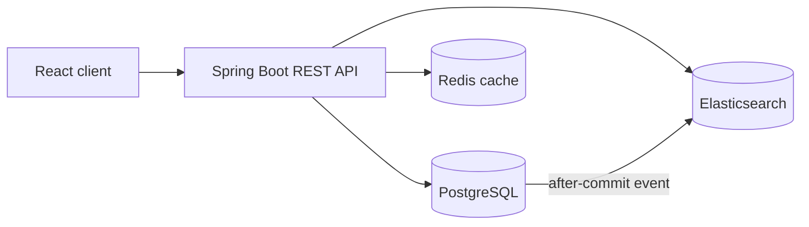

# Healthcare Appointment & Provider Search Platform

A production-style Spring Boot application for patient intake, provider discovery, and conflict-safe appointment scheduling. PostgreSQL owns transactional healthcare workflow data, Elasticsearch provides typo-tolerant symptom search, and Redis caches frequently requested provider profiles.

## What it supports

- Validated patient intake with unique email enforcement
- Provider profile creation and updates, including insurance plans and treated symptoms
- Relational provider filtering by specialty, city, state, and accepting status
- Weighted Elasticsearch discovery across symptoms, specialty, provider name, and bio
- Redis-backed provider profile caching with eviction on update and a 10-minute TTL
- Appointment booking, rescheduling, cancellation, patient history, and provider schedule views
- Transactional overlap prevention using a pessimistic provider lock
- RFC 9457-style problem responses for validation, conflict, and missing-resource errors
- Flyway-managed PostgreSQL schema, Actuator health checks, Prometheus metrics, and OpenAPI UI
- Responsive React intake, search, and booking workflow

## Architecture



PostgreSQL remains the source of truth. Provider changes publish an after-commit event and update Elasticsearch asynchronously, so a temporary search outage cannot roll back patient-facing database work. `POST /api/v1/providers/search/reindex` rebuilds the search index after recovery.

Concurrent booking requests serialize on the provider row before checking the half-open interval `existing.start < requested.end AND existing.end > requested.start`. This prevents double booking while allowing adjacent appointments.

## Run locally

Requirements: Docker with Compose. The API image builds with Java 17; no local Java installation is needed.

```bash
cp .env.example .env
docker compose up --build
```

The services are then available at:

- API: <http://localhost:8080/api/v1>
- OpenAPI/Swagger UI: <http://localhost:8080/docs>
- Health: <http://localhost:8080/actuator/health>
- Elasticsearch: <http://localhost:9200>

To run the React client in a second terminal:

```bash
cd frontend
npm install
npm start
```

Open <http://localhost:3000>. Set `API_URL` before building the frontend if the API is not at `http://localhost:8080/api/v1`.

## Example workflow

Create a patient:

```bash
curl -i http://localhost:8080/api/v1/patients \
  -H 'Content-Type: application/json' \
  -d '{
    "firstName":"Ava", "lastName":"Patel", "dateOfBirth":"1990-04-04",
    "email":"ava@example.com", "phone":"602-555-0100", "intakeNotes":"New patient"
  }'
```

Create a provider:

```bash
curl -i http://localhost:8080/api/v1/providers \
  -H 'Content-Type: application/json' \
  -d '{
    "name":"Dr. Jordan Lee", "specialty":"Neurology", "city":"Phoenix", "state":"AZ",
    "npi":"1234567890", "bio":"Migraine and headache specialist",
    "acceptingNewPatients":true, "acceptedInsurances":["Aetna","Cigna"],
    "treatedSymptoms":["migraine","headache","dizziness"]
  }'
```

Search by symptom (indexing runs just after the provider transaction commits):

```bash
curl 'http://localhost:8080/api/v1/providers/search?query=migrane'
```

Book a visit using the returned patient and provider IDs:

```bash
curl -i http://localhost:8080/api/v1/appointments \
  -H 'Content-Type: application/json' \
  -d '{
    "patientId":1, "providerId":1,
    "startTime":"2030-08-10T09:00:00", "endTime":"2030-08-10T09:30:00",
    "reason":"Recurring migraines"
  }'
```

## REST API

| Method | Endpoint | Purpose |
|---|---|---|
| `POST` | `/api/v1/patients` | Complete patient intake |
| `GET` | `/api/v1/patients/{id}` | Get a patient |
| `POST` | `/api/v1/providers` | Create a provider profile |
| `PUT` | `/api/v1/providers/{id}` | Update a provider and evict its cache entry |
| `GET` | `/api/v1/providers/{id}` | Get a cached provider profile |
| `GET` | `/api/v1/providers` | Filter providers using relational fields |
| `GET` | `/api/v1/providers/search?query=...` | Search symptoms and provider text in Elasticsearch |
| `POST` | `/api/v1/providers/search/reindex` | Rebuild the provider search index |
| `POST` | `/api/v1/appointments` | Schedule an appointment |
| `GET` | `/api/v1/appointments/{id}` | Get an appointment |
| `PATCH` | `/api/v1/appointments/{id}/reschedule` | Move an active appointment |
| `PATCH` | `/api/v1/appointments/{id}/cancel` | Cancel an active appointment |
| `GET` | `/api/v1/appointments?patientId=...` | List a patient's appointments |
| `GET` | `/api/v1/appointments?providerId=...&from=...&to=...` | View a provider schedule |

## Test and build

Backend tests use JUnit 5, Mockito, MockMvc, and an H2 database in PostgreSQL compatibility mode. Redis and Elasticsearch are isolated from the default test suite; search repository behavior is mocked at the API boundary.

```bash
mvn test
mvn package
cd frontend && npm run build
```

The suite includes service validation tests, a real JPA overlap-query test, and an end-to-end HTTP test covering intake, provider creation, successful booking, conflict rejection, and cancellation. JaCoCo writes its HTML report to `target/site/jacoco/index.html`.

## Configuration

All production settings have environment-variable overrides. See [.env.example](.env.example) for the complete local set.

| Variable | Default |
|---|---|
| `DATABASE_URL` | `jdbc:postgresql://localhost:5432/appointments` |
| `DATABASE_USERNAME` / `DATABASE_PASSWORD` | `appointments` |
| `REDIS_HOST` / `REDIS_PORT` | `localhost` / `6379` |
| `ELASTICSEARCH_URIS` | `http://localhost:9200` |
| `CORS_ALLOWED_ORIGINS` | `http://localhost:3000` |
| `PORT` | `8080` |


